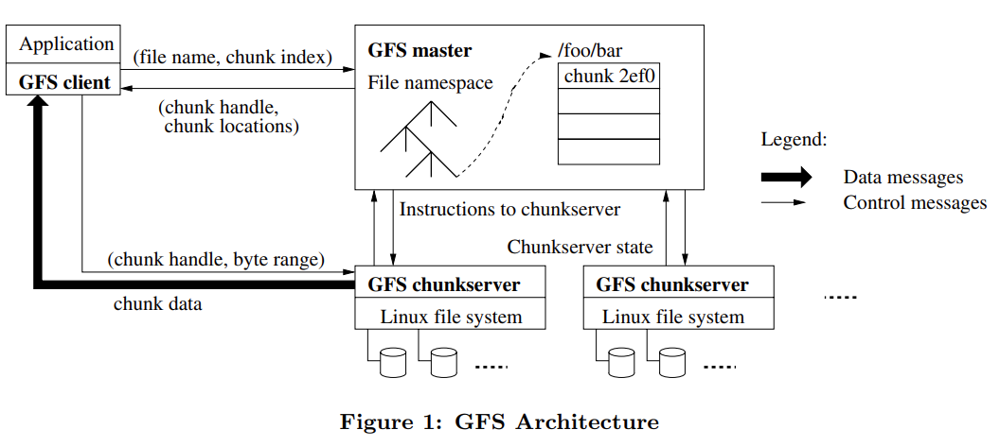
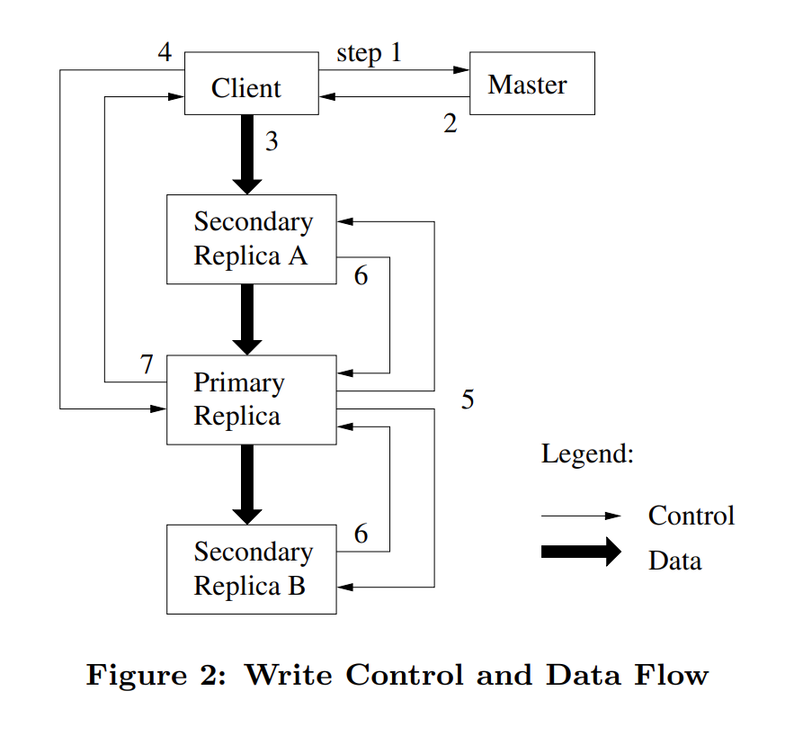
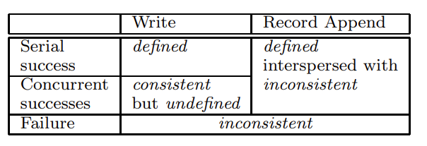

- how to support `record append`, `sequential read` ?

### chunk size: 64MB  

64MB is a relatively large chunk:

- pros: 
  - reduce metadata size
  - 
  <!-- TODO: -->

- cons: race condition happens (wr/rd at the same chunk) ↑, which leads to consistency problem.

### chunksever: 3 replicas

Leases

### master node: 1 (only one) 

- pros: easy to implement, and guarantee consistency (compared to multi-master nodes).

- cons: may become the system's performance bottleneck.

#### Metadata: 

1. namespace: file name → array of chunk handles (nv, non-volatile)

2. chunk handle → list of chunksevers (v, volatile) *because you can recover it by requiring severs during the reboot process

      ​                              current version (nv)

      ​			      primary chunk (v)

      ​			      lease expiration (v)

#### Optimizations

1. **separate control flow (master) & data flow** (client $\leftrightarrow$ chunksever)
2. the client will cache some master's metadata (also to relieve control flow burden)
3. (mentioned above) enlarge chunk size to reduce metadata size, so that all metadata can be placed in DRAM

> e.g. suppose each chunk's metadata < 64 bit, then for a 1TB file, it only needs: $\frac{3\cdot 1\text{TB}}{64 \text{MB}} \times 64\text{bit}$ for metadata storage.

### Availability

~~consensus algorithm (Paxos, Raft)~~

in GFS, we consider            
2 cases: metadata & file data.

#### Metadata 

i.e. the availability of the master node

solution: master-slave (主备思想) 

- primary master
- shadow master

maintain a write-ahead log (**WAL**).

pros: 

1. random Disk write → sequential log write (faster) 

2. sync between master & slave (faster, sync log instead of data)

   easier to replay

process: write WAL locally, then sync WAL, only then will we start file modification.

<!-- checkpoint: 	TODO: -->

#### File data

3 chunkserver replicas.

wr: write to 3 replicas, a crash will let the master node recreate another chunkserver. (maintain a checksum to detect errors)

##### Leases

permission of writes: transferred from master to client (60s)

> primary only decides the order of write (control flow), data flow doesn't have to go through it (instead adopt nearby principle)
> 
> \*On traditional master-slave strategy, data/control flow always flows from master to slave.

##### Chunk Replacement

3 cases:

1. new chunk created
2. chunk re-replication (occurs when some servers crashed)
3. rebalancing := new + delete chunk (reduce specific sever's burden)

3 principles: 

1. new chunkserver's utilization is low
2. new chunkserver doesn't create chunks intensively recently
3. the new replica is not allowed to be on the same rack

### Rd/Wr

write: overwrite & append
- overwrite: doesn't require performance, but correctness should be guaranteed.
- append: performance↑, allow anomalies, but the append data should be preserved (see Consistency Section).

Requirement: write all 3 replicas.

#### Pipeline

#### Data/Control flow split

- [ ] overwrite: how to ensure consistency when several chunks succeeded & failed.

  > As for `append`, it shouldn't be a problem: if failed, TODO: older version data?

read Op:
- metadata cache miss: query master node, then chunkserver
- metadata cache hit: query chunkserver, if it doesn't have the corresponding chunk, query master again (meaning that the cache should be invalidated)
  - checksum.

### Consistency Model

- consistent: A file region is consistent if all clients will always see the same data, regardless of which replicas they read from.
- inconsistent:
- defined:  A region is defined after a file data mutation if it is consistent and clients will see what the mutation writes in its entirety. (stricter than consistent)

- [x] why concurrent success is `consistent` but undefined`?

  Because there may be multiple chunks waiting to be modified 
  $⇒$ c1 (primary order: 1 2 3) c2 (primary order: 3 2 1)

- [ ] what's padding?
- [ ] why **atomic**?

### Snapshot
COW (copy on write)

### GC

